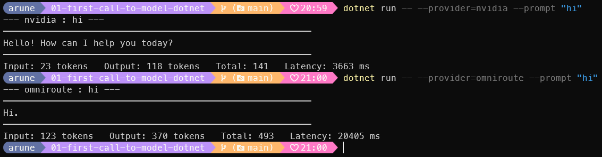

# Day 1 — The first model call, from .NET

*The Architect's Hour — Mon 31 Aug 2026.*

**A model call is just an HTTP POST.** No SDK, no framework, no client library —
`HttpClient` and `System.Text.Json` are enough to talk to a language model. That's the
whole lesson, and this CLI is the proof.

## The part that matters

```csharp
var payload = new Dictionary<string, object?>
{
    ["model"] = Model,
    ["messages"] = new object[]
    {
        new { role = "system", content = system },
        new { role = "user",   content = user },
    },
};

using var req = new HttpRequestMessage(HttpMethod.Post, ChatCompletionsUrl)
{
    Content = new StringContent(JsonSerializer.Serialize(payload), Encoding.UTF8, "application/json"),
};
req.Headers.Authorization = new AuthenticationHeaderValue("Bearer", BearerToken);

using var resp = await _http.SendAsync(req, ct);
```

The answer comes back at `choices[0].message.content`, the cost at `usage`. That's it.
Everything a vendor SDK does sits on top of these twenty lines.

Because it's just a URL, a model name, and a bearer token, pointing at a *second*
provider was one small subclass — same POST, same parsing, different endpoint. Both
OmniRoute and NVIDIA speak the OpenAI `chat/completions` shape, so
[`OpenAiCompatibleClient`](Providers/OpenAiCompatibleClient.cs) does the work and each
provider file is ~30 lines.



Same command, two backends, identical output shape — only the numbers move. Worth
staring at those numbers: `"hi"` cost 23 input tokens on one backend and 123 on the
other, and 370 output tokens bought a two-word reply. You're billed for tokens you
never see.

## Run it

```bash
dotnet run -- --provider=nvidia    --prompt "Explain an API gateway in 3 sentences."
dotnet run -- --provider=omniroute --prompt "Say hi"
echo "Say hi" | dotnet run -- --provider=omniroute
```

Optional: `--model`, `--temperature`, `--top-p`.

**OmniRoute** — a local gateway that routes through free-tier providers. Runs on
`localhost:20128`, no API key. Setup:
[my write-up](https://arunendapally.com/posts/omniroute-free-tier-routing-and-compression/).

**NVIDIA NIM** — grab a free key at [build.nvidia.com](https://build.nvidia.com/), then:

```bash
dotnet user-secrets set "NVIDIA_API_KEY" "your-key-here"   # or set the env var
```

Keys never touch a committed file — config resolves `env var → user-secret → default`.

## What bit me

- **Models are perishable.** Two NVIDIA defaults returned `HTTP 410 end-of-life`; one
  had been retired the week before. Never assume a model ID is still alive.
- **Reasoning models stay silent until asked.** The NVIDIA model returned nothing and
  timed out until I sent `chat_template_kwargs: { enable_thinking: true }`.
- **The alias is the config, not the model.** `openai/gpt-4o` gave me "no active
  credentials" on a gateway that was working fine. The fix was a named alias
  (`auto/best-free`) — what you *point at* decides what you hit.

---

*Design notes in [`SPEC.md`](SPEC.md).*
