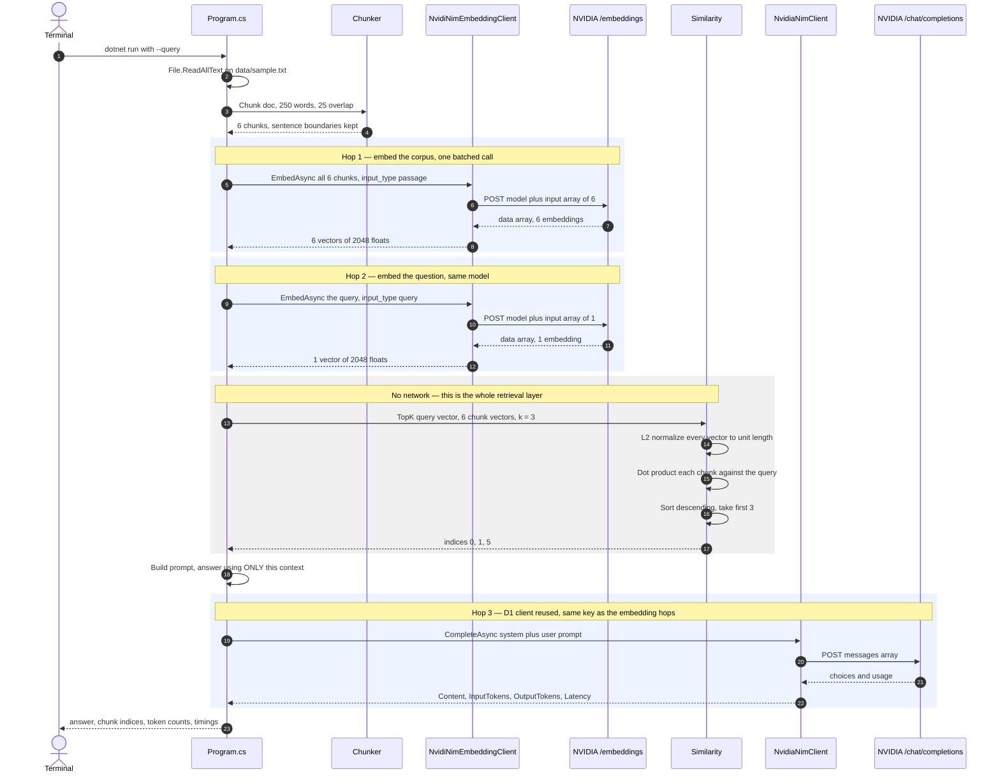

# Day 2 — RAG by hand, no framework

*Part of [**The Architect's Hour**](../../) — learning to build AI into applications,
one hour a day. Tue 01 Sep 2026.*

A document Q&A pipeline built entirely by hand. Chunk a document, get embeddings over
raw HTTP, find the most similar chunks with cosine similarity, stuff them into the
prompt, and call a chat model. No framework, no vector DB, no SDK.

**Retrieval is just a dot product.** Take a query, embed it, compare its vector to
every chunk vector, return the closest ones. The entire retrieval step is ~40 lines
of math.

## What's in the code

Six source files, 364 lines including comments, plus the corpus.

| File | What it does |
|---|---|
| `Program.cs` | Reads flags, runs the full pipeline: chunk → embed → search → answer |
| `Chunking.cs` | Sentence-aware chunking — splits on `.!?`, merges into ~250-word chunks with overlap |
| `Similarity.cs` | L2-normalize vectors in place, dot product, sort, return top-k indices |
| `Embedding.cs` | `IEmbedder` interface + `EmbedderBase` with latency timing (mirrors D1's `IModelClient`) |
| `Providers/OpenAiEmbeddingClient.cs` | Shared HTTP+JSON for OpenAI-shaped `/embeddings` endpoint |
| `Providers/NvidiNimEmbeddingClient.cs` | NVIDIA NIM endpoint, model, and bearer token |
| `data/sample.txt` | 18 paragraphs (1,140 words) about the stack — the corpus, 6 chunks at defaults |

The two provider files are 102 lines of HTTP plumbing that any framework hides —
that's the lesson, not bloat. The core retrieval logic is 166 lines.

## Setup

One key runs the whole pipeline — NVIDIA NIM serves both the embedding and the chat hop.

```bash
# Secrets — same NVIDIA key as D1, nothing else needed
dotnet user-secrets set "NVIDIA_API_KEY" "your-key-here"
```

Everything reads `env var → user-secret → default`:

| Variable | Default | Notes |
|---|---|---|
| `NVIDIA_API_KEY` | *(required)* | Same key as D1, the only secret D2 needs |
| `NVIDIA_EMBEDDING_MODEL` | `nvidia/nemotron-3-embed-1b` | Embeddings, 2048 dims |
| `NVIDIA_NIM_MODEL` | `nvidia/nemotron-3.5-lightning-30b-a3b` | Chat, inherited from D1 |

## Run it

```bash
cd week1/02-rag-by-hand

# Basic usage — queries the bundled sample doc
dotnet run -- --query "What is The Architect's Hour?"

# Pipe a query on stdin
echo "What are the three common mistakes?" | dotnet run

# Use your own document
dotnet run -- --doc path/to/your/doc.txt --query "your question"

# Tweak chunk size and top-k
dotnet run -- --chunk-size 300 --top-k 5 --query "your question"
```


Two questions, two different chunk sets. The second one is the point: ask something the
document doesn't cover and the model says so instead of inventing an answer.

**Flags:**

| Flag | Default | What it does |
|---|---|---|
| `--doc` | `data/sample.txt` | Document to search (6 chunks at default size) |
| `--query` | *(stdin)* | Question to answer |
| `--top-k` | `3` | Number of chunks to retrieve |
| `--chunk-size` | `250` | Target words per chunk |
| `--chunk-overlap` | `25` | Words shared between adjacent chunks |

## What one run actually does

Typing one command sends **three HTTP requests**, not one. Two go to the embedding
endpoint, one to the chat endpoint — all three to NVIDIA, on one key. Everything
between them is local arithmetic.



Two things the diagram makes obvious. The **document never reaches the chat model** —
only the 3 winning chunks do, which is why input token count barely moves as the corpus
grows. And the **same embedding model must serve both hops**: vectors from different
models have no shared meaning, so comparing them returns confident nonsense.

## Concepts this day introduces

**RAG (Retrieval-Augmented Generation):** The model doesn't have your data. So you
retrieve the relevant pieces first, stuff them into the prompt, and let the model
answer from that context. Three steps: embed, search, augment.

**Embeddings:** An embedding model converts text into a list of numbers (a vector).
Similar texts produce similar vectors. The dimension (2048 for this model) is the
length of that list. You can send many texts in one batched request.

**Cosine similarity:** To compare two vectors, make each one unit length (L2 normalize)
and multiply element-by-element, then add up the products. The result is between -1
and 1. Higher means more similar. This is the entire retrieval step.

**Sentence-aware chunking:** Don't split in the middle of a sentence. Split on
`.!?` boundaries, then merge sentences into chunks targeting a word count. Overlap
between adjacent chunks prevents losing context at the seam.

## What broke

- **NVIDIA 404 on embeddings:** The model name changed — `nvidia/embed-qa-4` doesn't
  exist anymore. Found the correct model (`nvidia/nemotron-3-embed-1b`) by browsing
  build.nvidia.com's model catalog.
- **NVIDIA 400 without `input_type`:** NVIDIA NIM requires an `input_type` parameter
  (`"passage"` for documents, `"query"` for questions). Not clearly documented;
  discovered by reading the API reference on the model page.
- **OmniRoute embedding proxy has no credentials:** The local OmniRoute proxy does chat
  fine but has no embedding provider configured. Rather than debug proxy config, D2 drops
  OmniRoute entirely and runs NVIDIA end to end — one key for both hops. D1's provider
  swap still stands; a RAG day just isn't the place to demo it.
- **The dimension I printed was a lie:** the startup line read `chunks[0].Length` — the
  *character* count of the first chunk — and printed it as "dims". It said `1540`, which
  looked plausible enough that it reached the README. The model returns **2048**. A wrong
  number that looks right is worse than a crash.
- **Overlap silently did nothing:** when a flush carried the whole chunk into the tail,
  the word counter wasn't reset with it, so every following chunk flushed one sentence
  early and never overlapped. Invisible on the sample doc, obvious on uniform text.

## Stack diagram

```
   model  →  prompt  →  retrieval  →  tools  →  agent  →  evaluation
                                     ▲
                                  you are here
```

| Box | What it is |
|---|---|
| **model** | one POST, one answer, priced in tokens (D1) |
| **prompt** | what you put in the messages array, and how you version it |
| **retrieval** | filling that array with facts the model doesn't have ← **today** |
| **tools** | letting the model ask *you* to run something, then calling back |
| **agent** | a loop over model and tools that decides when it's done |
| **evaluation** | how you know it still works after you change a prompt |

---

*Design notes in [`SPEC.md`](SPEC.md).*
