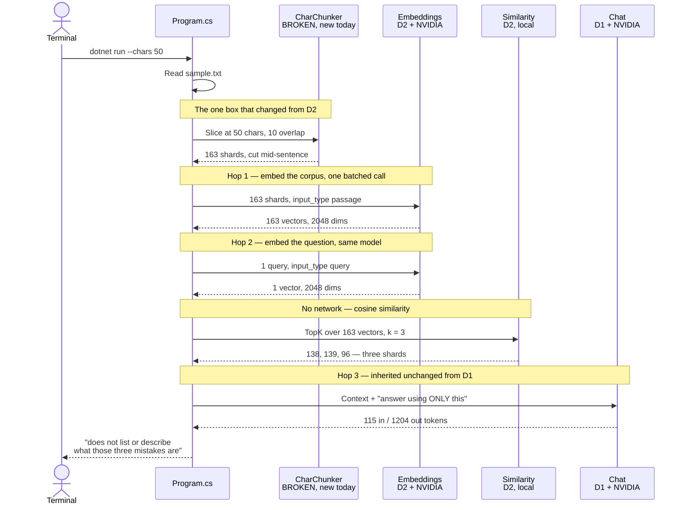

# Day 3 — Break it on purpose

*Part of [**The Architect's Hour**](../../) — learning to build AI into applications,
one hour a day. Wed 02 Sep 2026.*

Take the D2 RAG pipeline (chunk → embed → cosine search → stuff top-k → chat) and run
it with a **deliberately broken chunker** that slices at a fixed character count and
ignores sentence boundaries. The point: see exactly how retrieval fails when chunks split
sentences in half, and capture the wrong answers verbatim for the post.

Everything else (embeddings, similarity, chat) is inherited from D2 via
`ProjectReference`. The lesson is isolated: the same pipeline that worked yesterday fails
today purely because of how the text was sliced.

## What's in the code

Two files, ~120 lines total.

| File | What it does |
|---|---|
| `CharChunker.cs` | The mistake: slices at exactly N characters, mid-sentence, with overlap |
| `Program.cs` | Reuses D2's embed/retrieve/chat; `--chars` drives the chunk size |

Inherited from D2 (no duplication):
- `Embedding.cs`, `Providers/`, `Similarity.cs` — embeddings + cosine search
- `D1.IModelClient` + `D1.Providers.*` — chat hop

## Setup

Same secrets as D1/D2 (shared `UserSecretsId`):

```bash
# Already set from D1/D2
dotnet user-secrets set "NVIDIA_API_KEY" "your-key-here"
```

Every setting, resolved env var → user-secret → default:

| Setting | Default | What it does |
|---|---|---|
| `NVIDIA_API_KEY` | *(required)* | Key for both hops; no default, errors if unset |
| `NVIDIA_EMBEDDING_MODEL` | `nvidia/nemotron-3-embed-1b` | Embedding model (2048 dims) |
| `NVIDIA_NIM_MODEL` | `nvidia/nemotron-3.5-lightning-30b-a3b` | Chat model for the answer hop |

## Run it

From `week1/03-break-it-on-purpose`:

**The break — 163 sentence shards, model says the answer isn't there:**

```bash
dotnet run -- --chars 50 --query "What are the three common mistakes that break a retrieval pipeline?"
```

**The other extreme — 2 chunks, retrieval is vacuous and the question drowns:**

```bash
dotnet run -- --chars 5000 --query "What are the three common mistakes that break a retrieval pipeline?"
```

**Guardrail holding on an unanswerable question:**

```bash
dotnet run -- --chars 50 --query "What is the capital of France?"
```

**Working control, if you want a side-by-side with D2's sentence-aware chunker:**

```bash
cd ../02-rag-by-hand && dotnet run -- --query "What are the three common mistakes that break a retrieval pipeline?"
```

**On your own document — the interesting version.** Point `--doc` at text you know well,
then walk `--chars` from 50 up to a few thousand and watch the answer degrade at both ends:

```bash
dotnet run -- --doc /path/to/your.txt --chars 50 --query "your question"
```

**Flags:**

| Flag | Default | What it does |
|---|---|---|
| `--doc` | `../02-rag-by-hand/data/sample.txt` | Document to search |
| `--query` | *(stdin)* | Question to answer |
| `--chars` | `50` | Char-chunk size (the breakage lever) |
| `--overlap` | `10` | Chars shared between adjacent chunks |
| `--top-k` | `3` | Number of chunks to retrieve |


## What one run actually does



**The diagram makes it obvious:** every box except `CharChunker` is D2 or D1 code, called
unchanged. The same embed + search + prompt that found the answer yesterday now retrieves
three sentence shards and reports the answer isn't there.

## Concepts this day introduces

**Chunk size is a retrieval hyperparameter.** Too small and you shatter the semantic
unit (a sentence or a fact spans multiple shards); too large and you drown the signal in
noise (the whole doc is one chunk, retrieval is meaningless). The "right" size depends
on the embedding model and the question type.

**Wrong chunk size is invisible from outside, obvious from inside.** From outside the
pipeline you get a calm, well-formed answer either way — nothing throws, and the wrong
answer has the same shape as the right one. From inside, where you can print the chunks
and the retrieved indices, it takes one glance at the fragments. That asymmetry is the
argument for building this by hand: the vantage point that makes the bug obvious is the
one a framework takes away from you.

**Retrieval failures look like generation failures.** At 50 chars the model says the
context doesn't list the three mistakes — and it's right, because the list was destroyed
by the chunker. The model isn't hallucinating; it's faithfully reporting what retrieval handed
it. This is why the D2 guardrail matters: it exposes the retrieval failure instead of
covering it with a guess.

**Overlap helps but can't fix a fundamentally wrong chunk size.** The 10-char overlap
at 50-char chunks just means each sentence fragment appears in 2-3 shards instead of 1.
The top-3 still misses the full sentence.

## What broke (on purpose)

- **50-char chunks shatter sentences.** The three mistakes live in three sentences; each
  becomes several mid-word shards. Top-3 retrieves fragments 138, 139 and 96, and the model
  answers: *"mentions that three mistakes commonly break a hand-built retrieval pipeline,
  but it does not list or describe what those three mistakes are."* It's right — retrieval
  handed it the mention and threw away the list. 115 input tokens, against D2's 948.
- **5000-char chunks lose the question, not just the signal.** The whole 1,140-word doc
  fits in 2 chunks, so retrieval is vacuous — but the answer doesn't survive either. Buried
  after ~1,400 tokens of context, the model replied *"The provided context does not contain
  a question to answer."* Too-large chunks don't only drown the facts; they drown the ask.
- **Neither failure looks like a failure.** Nothing throws. Both wrong chunk sizes return
  a calm, well-formed sentence — the same shape the correct run returns. The only signal
  from the outside is the token count: 115 in, against D2's 948 for the identical question.

## Stack diagram

```
   model  →  prompt  →  retrieval  →  tools  →  agent  →  evaluation
                            ▲
                      you are here
```

| Box | What it is |
|---|---|
| **model** | one POST, one answer, priced in tokens (D1) |
| **prompt** | what you put in the messages array, and how you version it |
| **retrieval** | filling that array with facts the model doesn't have ← **today (broken)** |
| **tools** | letting the model ask *you* to run something, then calling back |
| **agent** | a loop over model and tools that decides when it's done |
| **evaluation** | how you know it still works after you change a prompt |

---

*Design notes in [`SPEC.md`](SPEC.md).*